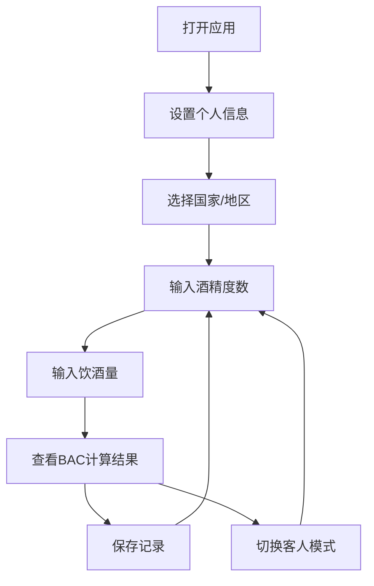

## 1. 产品概述
酒精计划（Druk）应用，帮助用户计算和监控血液酒精浓度
- 解决用户在饮酒时对酒精摄入量的认知需求，提供科学的血液酒精浓度计算工具，目标用户为普通消费者
- 通过直观的界面和个性化设置，帮助用户做出更明智的饮酒决策，提升饮酒安全意识

## 2. 核心功能

### 2.1 用户角色
| 角色 | 注册方式 | 核心权限 |
|------|---------------------|------------------|
| 普通用户 | 无需注册 | 使用所有功能，本地存储个人设置和饮酒记录 |

### 2.2 功能模块
1. **主页面**：酒精计算器、状态显示、快捷设置
2. **设置页面**：个人信息设置、国家/地区选择
3. **历史记录**：饮酒记录查看和管理

### 2.3 页面详情
| 页面名称 | 模块名称 | 功能描述 |
|-----------|-------------|---------------------|
| 主页面 | 酒精计算器 | 输入酒精度数、饮酒量，计算血液酒精浓度（BAC），支持毫升和两单位切换 |
| 主页面 | 状态显示 | 根据BAC值显示不同的状态提示和氛围颜色，包括完美微醺、酒驾、醉驾等状态 |
| 主页面 | 快捷设置 | 提供常见酒类的酒精度数预设，如啤酒、葡萄酒、威士忌等 |
| 主页面 | 客人模式 | 临时修改体重和性别，方便为他人计算BAC |
| 主页面 | 国家/地区选择 | 切换不同国家/地区的酒驾标准，自动调整状态提示 |
| 主页面 | 保存记录 | 将当前饮酒情况保存到本地历史记录 |
| 设置页面 | 个人信息设置 | 设置默认体重和性别，影响BAC计算结果 |
| 设置页面 | 国家/地区设置 | 选择默认国家/地区，查看不同国家的酒驾和醉驾标准 |
| 历史记录 | 记录管理 | 查看过去的饮酒记录，包括时间、饮酒量、BAC值和状态 |

## 3. 核心流程
用户打开应用 → 设置个人信息（体重、性别） → 选择国家/地区 → 输入酒精度数和饮酒量 → 查看BAC计算结果和状态 → 保存记录（可选）

## 4. 用户界面设计
### 4.1 设计风格
- 主色调：深色背景，根据BAC值变化的氛围颜色（蓝色、琥珀色、红色）
- 按钮风格：圆角按钮，半透明材质效果，轻微阴影
- 字体：系统默认字体，标题使用Georgia字体，数字使用等宽字体
- 布局风格：卡片式布局，玻璃拟态效果，垂直滚动
- 图标风格：系统默认图标，配合酒精相关的emoji

### 4.2 页面设计概览
| 页面名称 | 模块名称 | UI元素 |
|-----------|-------------|-------------|
| 主页面 | 酒精计算器 | 酒精度数滑块（0.01-0.70），饮酒量输入框（支持ml和两切换），BAC值显示（大字体） |
| 主页面 | 状态显示 | 根据BAC值变化的背景渐变色，状态徽章（完美微醺、酒驾、醉驾等），个性化引用文字 |
| 主页面 | 快捷设置 | 水平滚动的酒类预设芯片（啤酒、葡萄酒、威士忌等），BAC值预设芯片（完美微醺、酒驾、醉驾） |
| 主页面 | 客人模式 | 体重输入框，性别选择器（男/女），切换按钮 |
| 主页面 | 国家/地区选择 | 下拉菜单，显示国旗和国家名称，自动更新酒驾标准 |
| 主页面 | 保存记录 | 底部保存按钮，保存成功提示动画 |
| 设置页面 | 个人信息设置 | 体重输入框，性别选择器，说明文字 |
| 设置页面 | 国家/地区设置 | 国家/地区选择器，显示当前国家的酒驾和醉驾标准 |
| 历史记录 | 记录管理 | 列表视图，显示每条记录的时间、饮酒量、BAC值和状态 |

### 4.3 响应式设计
- 移动端优先设计，适配不同屏幕尺寸的iOS设备
- 触控优化，按钮和输入框大小适中，支持手势操作
- 横屏适配，确保在横屏模式下内容展示正常

### 4.4 3D场景指导（不适用）
- 本产品为工具应用，不涉及3D场景